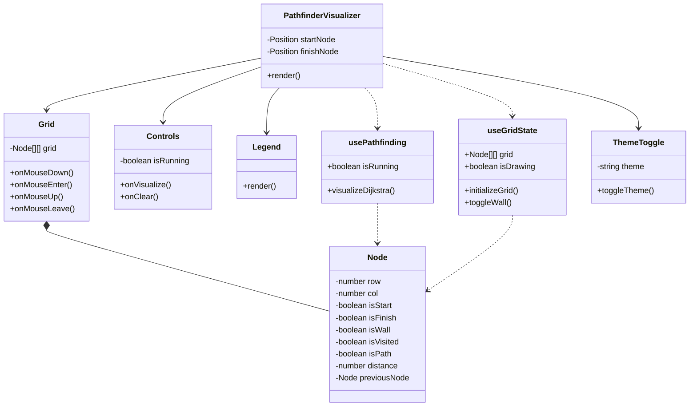

# Pathfinding Visualizer

A React-based interactive pathfinding visualizer that demonstrates Dijkstra's algorithm. Users can draw walls, visualize the pathfinding process, and toggle between light and dark modes.

## 🚀 Features

- Interactive grid system with click-and-drag wall creation
- Dijkstra's pathfinding algorithm visualization
- Responsive design with Tailwind CSS
- Dark mode support
- Modular and maintainable code structure
- Built with TypeScript for type safety

## 🛠️ Tech Stack

- React
- TypeScript
- Tailwind CSS
- Shadcn/UI Components

## 📁 Project Structure

```
src/
├── components/
│   └── PathfinderVisualizer/
│       ├── index.tsx
│       ├── useGridState.ts
│       ├── usePathfinding.ts
│       ├── types.ts
│       ├── constants.ts
│       └── components/
│           ├── Grid.tsx
│           ├── Node.tsx
│           ├── Controls.tsx
│           └── Legend.tsx
├── algorithms/
│   └── pathfinding/
│       ├── dijkstra.ts
│       └── utils.ts
└── utils/
    └── grid.ts
```

## 🚀 Getting Started

1. Clone the repository:
```bash
git clone https://github.com/yourusername/pathfinding-visualizer.git
```

2. Install dependencies:
```bash
npm install
# or
yarn install
```

3. Run the development server:
```bash
npm run dev
# or
yarn dev
```

4. Open [http://localhost:3000](http://localhost:3000) in your browser

## 🎮 How to Use

1. **Draw Walls**: Click and drag on the grid to create walls
2. **Start/End Nodes**: Pre-placed green (start) and red (end) nodes
3. **Find Path**: Click "Find Path" to visualize Dijkstra's algorithm
4. **Clear Grid**: Reset the grid to its initial state
5. **Dark Mode**: Toggle between light and dark themes

## 🧩 Components

- **Grid**: Main visualization area
- **Node**: Individual cell in the grid
- **Controls**: Buttons for pathfinding and grid clearing
- **Legend**: Visual guide for node types
- **ThemeToggle**: Dark/light mode switch



## 🤝 Contributing

1. Fork the repository
2. Create your feature branch (`git checkout -b feature/amazing-feature`)
3. Commit your changes (`git commit -m 'Add some amazing feature'`)
4. Push to the branch (`git push origin feature/amazing-feature`)
5. Open a Pull Request

## 📝 License

This project is licensed under the MIT License - see the [LICENSE.md](LICENSE.md) file for details

## 🙏 Acknowledgments

- Inspired by Clement Mihailescu's Pathfinding Visualizer
- Built with Shadcn UI components
- Styled with Tailwind CSS